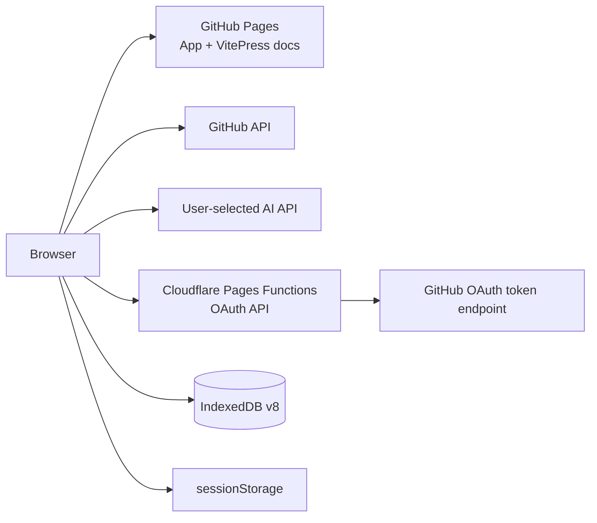

<p align="center">
  
</p>

<h1 align="center">StarHub</h1>

<p align="center"><strong>A local-first manager for large GitHub Stars collections</strong></p>
<p align="center">Category governance · Highlights · Reviewed AI classification · README preview · Search and batch operations</p>

<p align="center">
  <a href="README.md">中文</a> · <a href="README.en.md">English</a> ·
  <a href="https://hujinghaoabcd.github.io/StarHub/">Live app</a> ·
  <a href="https://hujinghaoabcd.github.io/StarHub/docs/">Documentation</a>
</p>

<p align="center">
  <a href="https://github.com/hujinghaoabcd/StarHub/actions/workflows/ci.yml"></a>
  <a href="https://github.com/hujinghaoabcd/StarHub/actions/workflows/deploy-pages.yml"></a>
  <a href="https://github.com/hujinghaoabcd/StarHub/blob/main/LICENSE"></a>
  
  
</p>

## What StarHub does

StarHub organizes hundreds, thousands, or tens of thousands of GitHub Stars. It stores repository snapshots, category relationships, highlights, AI review drafts, and bounded README summaries in the current browser. GitHub provides the source repository data, while AI requests are sent only to the provider configured by the user.

StarHub is not a shared bookmarking service and does not ship one person's private taxonomy as a universal standard. Every user can create regular categories or import a formal registry containing stable IDs, bilingual names, aliases, descriptions, examples, and exclusions.

## Live services

| Service | URL | Purpose |
|---|---|---|
| Application | https://hujinghaoabcd.github.io/StarHub/ | Sign in, synchronize, and manage Stars |
| Documentation | https://hujinghaoabcd.github.io/StarHub/docs/ | User, deployment, and development manuals |
| OAuth API | https://starhub-oauth.pages.dev/api | Server-side GitHub OAuth code exchange |
| Health check | https://starhub-oauth.pages.dev/api/health | Verify backend configuration |

The OAuth API does not centrally store GitHub tokens, categories, or AI drafts. Its only responsibility is to keep the OAuth Client Secret off the static frontend and exchange an authorization code for a token.

## Feature overview

### Reliable repository synchronization

- Fetches the complete GitHub Stars collection page by page.
- Replaces the local snapshot only after every required page succeeds.
- Preserves the previous complete snapshot after partial failure, cancellation, or timeout.
- Removes stale relations and highlights after a repository is unstarred.
- Sorts the complete result set by update time, creation time, stars, name, or highlight state before pagination.
- Supports 50, 100, 200, 500, and 1,000 repositories per page.
- Searches names, descriptions, and languages and filters by language, category, uncategorized state, or highlight.

### Repository detail and README safety

- One summary card contains metadata, About, GitHub Pages, GitHub, and Unstar actions.
- README requests are abortable and stale responses are ignored during rapid switching.
- Markdown is parsed in a Web Worker and sanitized with DOMPurify.
- Oversized source documents and code blocks are bounded to protect the browser main thread.

### Categories and formal registries

- Regular categories support names, colors, emoji, and many-to-many repository relationships.
- Batch operations can add categories or replace the selected repositories' category set.
- Imports accept TXT, CSV, JSON, StarHub backups, and formal registry documents.
- A migration preview distinguishes create, rename, merge, update, unchanged, and conflict operations.
- Safe renaming preserves the category ID.
- Merging migrates and deduplicates every `repoTags` relationship.
- A complete category snapshot is created before migration and the latest migration can be undone.
- The manager supports search, repository-count sorting, and empty-category filtering.

Formal registry example:

```json
{
  "version": "my-taxonomy-2026-08",
  "tags": [
    {
      "categoryId": "gis.web-mapping",
      "nameZh": "WebGIS 与在线地图",
      "nameEn": "Web GIS and Web Mapping",
      "aliases": ["WebGIS", "web maps"],
      "descriptionZh": "浏览器端地图、在线空间服务与 WebGIS 应用。",
      "descriptionEn": "Browser mapping, online spatial services, and Web GIS applications.",
      "examples": ["Leaflet", "OpenLayers", "MapLibre"],
      "exclusions": ["desktop-only GIS", "database drivers only"],
      "level1": "GIS and Spatial Computing",
      "level2": "Web GIS and Web Mapping"
    }
  ]
}
```

### Repository highlights

A highlight is intentionally separate from categories and is not a second folder system. Users can toggle a highlight from the detail header, update multiple selected repositories, filter highlighted repositories, sort by marking time, export highlights in backup v4, and automatically remove stale records after unstar.

### Reviewed and resumable AI classification

StarHub supports OpenAI, Anthropic Claude, DeepSeek, Alibaba Qwen, and Zhipu AI. AI output is always a draft until the user confirms a commit.

```text
Select scope and estimate usage
→ metadata-only first pass
→ validate repository/category IDs, duplicates, and omissions
→ persist a bounded review segment
→ fetch README evidence only for difficult results
→ compare baseline and enhanced drafts
→ user confirmation
→ one IndexedDB transaction
→ optional undo
```

Important safeguards:

- The model can choose only IDs from the current formal registry.
- A task records provider, model, prompt version, and registry version.
- Large tasks are generated, reviewed, and committed one bounded segment at a time.
- Tasks support pause, resume, cancellation, and failed-item retry.
- A paused task can commit the currently reviewed results and then end.
- Results below 65% confidence are unchecked by default.
- README content is cached only for difficult cases and is treated as untrusted input.

AI classification remains an experimental assistant. Model confidence is not measured accuracy; important classifications require human review.

### Local data and privacy boundaries

StarHub currently uses IndexedDB v8:

| Table | Purpose |
|---|---|
| `repos` | Authoritative GitHub repository snapshot |
| `tags` | Category metadata and formal registry fields |
| `repoTags` | The sole source of repository-category relationships |
| `classificationTasks` | AI task progress, provider, model, and versions |
| `classificationTaskItems` | Per-repository drafts, evaluations, errors, and enhancements |
| `classificationReadmeCache` | Bounded README summaries for difficult cases |
| `repositoryHighlights` | Independent repository highlights |
| `categoryMigrationSnapshots` | Local category migration rollback snapshots |

Storage rules:

- GitHub token: `sessionStorage`, hard expiry after 12 hours.
- AI API key: `sessionStorage`, cleared when the page session ends and removable on demand.
- Theme, language, non-secret AI preferences, and category presets: `localStorage`.
- Repository, category, task, and highlight data: IndexedDB.
- Backup format v4 exports repositories, category relations and registry metadata, highlights, and category presets.
- AI tasks, README cache, and migration rollback snapshots are not yet included in portable backups.

## Screenshots

> **Screenshot placeholder — login and OAuth entry**
> Show language/theme controls, the GitHub login action, and the privacy notice without exposing a real authorization code.

> **Screenshot placeholder — 17k-scale workspace and detail**
> Show categories, highlights, repository list, sorting, pagination, and a detail action bar that does not overlap the description.

> **Screenshot placeholder — formal registry migration preview**
> Show registry version, create/rename/merge/conflict counts, operation details, and a conflict-disabled apply button.

> **Screenshot placeholder — AI task and human review**
> Show segment progress, failed-item retry, confidence, reasoning, evaluation, and README enhancement comparison.

> **Screenshot placeholder — highlights and large-page controls**
> Show highlight filtering, batch marking, sorting, and 1,000-item pagination in both themes.

## Local development

Requirements:

- Node.js version from [`.nvmrc`](.nvmrc)
- npm with `npm ci`
- a separate local GitHub OAuth App
- an environment capable of running Cloudflare Wrangler

```bash
git clone https://github.com/hujinghaoabcd/StarHub.git
cd StarHub
npm ci
cp .dev.vars.example .dev.vars
```

Configure `.dev.vars`:

```ini
CLIENT_ID=your_local_oauth_client_id
CLIENT_SECRET=your_local_oauth_client_secret
ALLOWED_ORIGINS=http://localhost:5173
GITHUB_REDIRECT_URI=http://localhost:5173/
```

Create an uncommitted `.env.local` with the Client ID from the same local OAuth App:

```ini
VITE_GITHUB_CLIENT_ID=your_local_oauth_client_id
```

Never put the Client Secret in a `VITE_*` variable.

Start both processes:

```bash
# terminal 1
npm run cloudflare:dev

# terminal 2
npm run dev
```

Set both the Homepage URL and callback URL of the local OAuth App to `http://localhost:5173/`.

## Production architecture



Production requires a Cloudflare Pages Function containing the OAuth Client Secret, a GitHub OAuth App whose callback is the Pages root, and GitHub Actions variables named `VITE_API_BASE_URL` and `VITE_GITHUB_CLIENT_ID`. Merges to `main` build the application and documentation, deploy Pages, and run a public smoke test.

See [Deployment](docs/DEPLOYMENT.md), [Cloudflare OAuth](docs/deploy/cloudflare.md), [Self-hosting](docs/deploy/self-host.md), and [OAuth configuration](docs/guide/oauth.md).

## Validation

```bash
npm run check
```

The complete check runs ESLint, Vue/TypeScript checks, all unit tests, Cloudflare type-checking, OAuth documentation verification, GitHub Pages subpath builds, CSP scanning, static security policy checks, the production dependency audit, and the Cloudflare bundle build.

## Current limitations and roadmap

- PWA installation and full offline mode are not currently enabled.
- Data is browser-local; account-level cross-device sync is not implemented.
- AI keys are still sent directly from the browser to the selected provider.
- The UI is primarily optimized for desktop screens.
- Full browser E2E, accessibility coverage, and large-scale performance benchmarks remain incomplete.
- The next planned batch is D2: a formal uncategorized queue and continuous classification after synchronization.

Read [Project Status](docs/development/PROJECT_STATUS.md) and the [Detailed Handoff](docs/development/NEXT_PHASE_HANDOFF.md) before continuing development.

## Documentation map

| Need | Document |
|---|---|
| First use | [Basic Usage](docs/guide/basic.md) |
| AI configuration | [AI Configuration](docs/config/ai.md) |
| Category governance | [Categories and Registries](docs/guide/tags.md) |
| Backup and recovery | [Data Management](docs/config/data.md) |
| Deployment | [Deployment Guide](docs/DEPLOYMENT.md) |
| Troubleshooting | [Troubleshooting](docs/TROUBLESHOOTING.md) |
| Contributing | [Contributing](CONTRIBUTING.md) |
| Taking over development | [Detailed Handoff](docs/development/NEXT_PHASE_HANDOFF.md) |

## Security and license

Never include GitHub tokens, AI keys, OAuth Client Secrets, private repository names, or complete private READMEs in issues, screenshots, or logs. Custom AI endpoints must use HTTPS and the target hostname must be verified before transmitting a key.

StarHub is released under the [MIT License](LICENSE).
