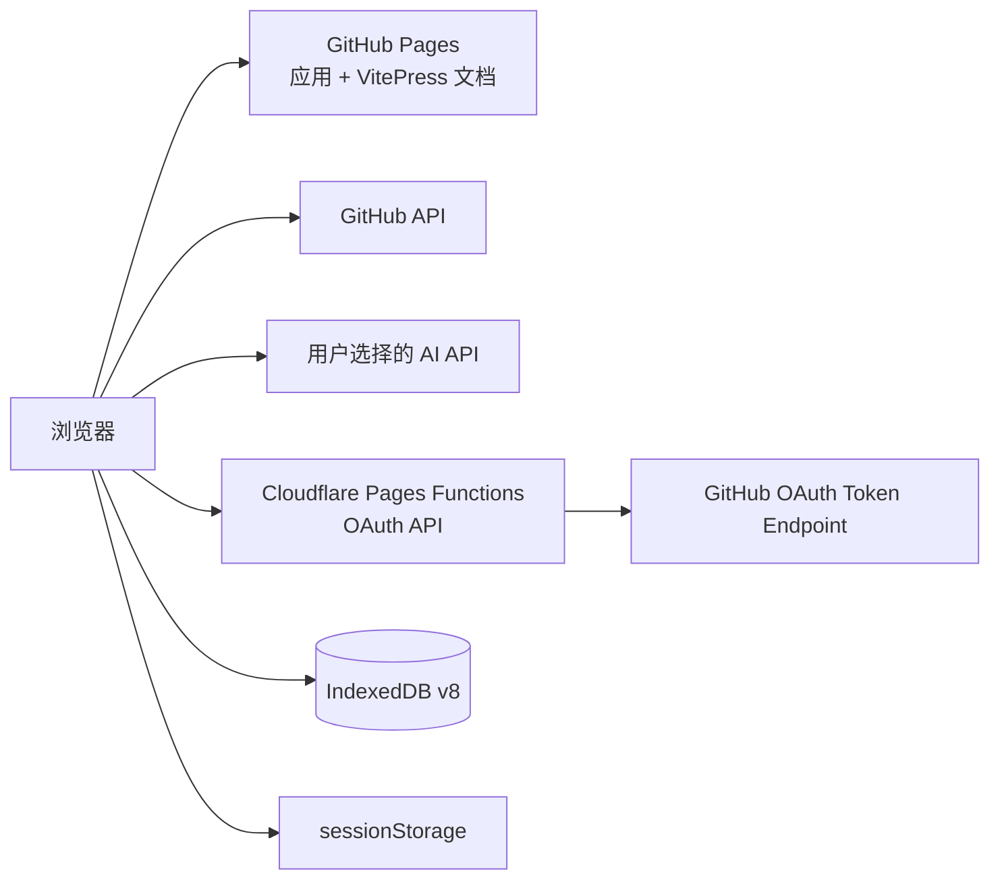

<p align="center">
  
</p>

<h1 align="center">StarHub</h1>

<p align="center"><strong>面向大量 GitHub Stars 的本地优先管理工具</strong></p>
<p align="center">分类治理 · 重点项目 · AI 审核分类 · README 预览 · 搜索与批量管理</p>

<p align="center">
  <a href="README.md">中文</a> · <a href="README.en.md">English</a> ·
  <a href="https://hujinghaoabcd.github.io/StarHub/">在线应用</a> ·
  <a href="https://hujinghaoabcd.github.io/StarHub/docs/">完整文档</a>
</p>

<p align="center">
  <a href="https://github.com/hujinghaoabcd/StarHub/actions/workflows/ci.yml"></a>
  <a href="https://github.com/hujinghaoabcd/StarHub/actions/workflows/deploy-pages.yml"></a>
  <a href="https://github.com/hujinghaoabcd/StarHub/blob/main/LICENSE"></a>
  
  
</p>

## StarHub 是什么

StarHub 用于整理数百、数千乃至上万条 GitHub Stars。它把仓库快照、分类关系、重点标记、AI 审核草稿和 README 缓存保存在当前浏览器，通过 GitHub API 同步收藏，通过用户自行配置的 AI 服务生成分类建议。

它不是共享收藏社区，也不会把某一位用户的个人分类清单内置为所有人的标准。每位用户可以创建自己的普通分类，或导入包含稳定 ID、中英文名称、别名、说明、示例和排除项的正式分类注册表。

### 当前适合解决的问题

- GitHub Stars 数量过多，依靠原生时间列表难以查找；
- 同一个仓库需要同时属于多个主题；
- 希望把少量关键仓库单独标为“重点”，但不想创建额外分类；
- 希望使用 AI 批量生成分类建议，同时保留人工审核、失败重试和撤销能力；
- 希望在应用内查看仓库元数据、About、GitHub Pages 和 README；
- 希望分类重命名或合并时不丢失已有仓库关系。

## 在线地址

| 服务 | 地址 | 用途 |
|---|---|---|
| StarHub 应用 | https://hujinghaoabcd.github.io/StarHub/ | GitHub 登录、同步与本地管理 |
| 项目文档 | https://hujinghaoabcd.github.io/StarHub/docs/ | 用户、部署和开发文档 |
| OAuth API | https://starhub-oauth.pages.dev/api | GitHub OAuth code 兑换 |
| OAuth 健康检查 | https://starhub-oauth.pages.dev/api/health | 检查后端变量是否完整 |

> GitHub OAuth Token、分类和 AI 草稿不会集中保存到 StarHub 服务器。OAuth API 只负责使用服务端 Client Secret 兑换 GitHub Token。

## 功能全景

### 仓库同步与浏览

- 分页获取当前账户的全部 GitHub Stars；
- 只有完整快照获取成功后才原子替换本地仓库；
- 部分失败、取消或超时时保留上一次完整数据；
- 自动清理已经取消 Star 的仓库关系和重点标记；
- 支持按更新时间、创建时间、Star 数、名称和重点状态排序；
- 支持 50、100、200、500、1000 条分页；
- 支持名称、描述和语言搜索，以及语言、分类、未分类和重点项目筛选。

### 仓库详情

- 单一摘要卡片展示名称、描述、语言、Star、Fork、许可证和更新时间；
- 提供 GitHub、About 网站和 GitHub Pages 入口；
- 支持直接取消 Star；
- README 在 Web Worker 中解析，切换仓库时会取消旧请求并忽略陈旧响应；
- Markdown 经过 DOMPurify 清理，超大源码和代码块有明确上限。

### 分类与正式注册表

- 普通分类支持名称、颜色、Emoji 和多仓库关系；
- 批量添加分类或替换所选仓库的分类；
- 导入 TXT、CSV、JSON、StarHub 备份或正式注册表；
- 导入前预览新增、重命名、合并、更新、不变和冲突；
- 安全重命名保持分类 ID 不变；
- 合并分类完整迁移并去重全部 `repoTags`；
- 迁移前保存快照，支持撤销最近一次迁移；
- 分类管理支持搜索、项目数排序和空分类筛选；
- 新分类自动选择尽量不重复的颜色，长名称在侧栏缩略显示。

正式注册表可以包含：

```json
{
  "version": "my-taxonomy-2026-08",
  "tags": [
    {
      "categoryId": "gis.web-mapping",
      "nameZh": "WebGIS 与在线地图",
      "nameEn": "Web GIS and Web Mapping",
      "aliases": ["WebGIS", "在线地图"],
      "descriptionZh": "浏览器端地图、在线空间服务与 WebGIS 应用。",
      "descriptionEn": "Browser mapping, online spatial services, and Web GIS applications.",
      "examples": ["Leaflet", "OpenLayers", "MapLibre"],
      "exclusions": ["纯桌面 GIS", "仅提供空间数据库驱动"],
      "level1": "GIS 与空间计算",
      "level2": "WebGIS 与在线地图"
    }
  ]
}
```

### 重点项目

“重点项目”是独立于分类的轻量标记，不是第二套收藏夹：

- 仓库详情中一键标记或取消；
- 仓库列表批量标记；
- 仅查看重点项目；
- 按重点时间排序；
- 随备份导出，并在取消 Star 后自动清理。

### AI 分类任务

StarHub 当前支持 OpenAI、Anthropic Claude、DeepSeek、通义千问和智谱 AI。AI 功能采用“生成草稿—人工审核—确认写入”流程，不会直接改写正式分类。

```text
选择范围并估算用量
→ 元数据初筛（名称、描述、语言、Topics）
→ 严格校验仓库 ID、分类 ID、重复和遗漏
→ 分段保存审核草稿
→ 对低置信度或人工判错项读取 README
→ 比较增强前后结果
→ 用户确认
→ 单次事务写入
→ 可撤销
```

主要约束：

- 模型只能返回当前正式注册表中的短 ID，写入前映射回稳定分类 ID；
- 任务记录供应商、模型、提示词版本和注册表版本；
- 默认每批 50 个仓库，大任务按有界分段执行；
- 支持随机试验样本、暂停、继续、取消和失败项重试；
- 暂停时可以写入当前已审核结果并结束任务；
- 置信度低于 65% 的结果默认不选中；
- README 只用于疑难项并写入有界缓存，不对全部仓库批量抓取。

> AI 分类仍属于实验性辅助功能。置信度是模型自评，不是准确率；重要分类应人工抽查。

### 数据、备份与隐私

当前数据库版本为 IndexedDB v8：

| 表 | 内容 |
|---|---|
| `repos` | GitHub 仓库权威快照 |
| `tags` | 分类元数据与正式注册表字段 |
| `repoTags` | 仓库—分类关系的唯一事实来源 |
| `classificationTasks` | AI 任务、进度、模型和版本信息 |
| `classificationTaskItems` | 逐仓库草稿、审核、失败和增强状态 |
| `classificationReadmeCache` | 疑难项 README 摘要缓存 |
| `repositoryHighlights` | 重点项目 |
| `categoryMigrationSnapshots` | 分类迁移撤销快照 |

存储边界：

- GitHub Token：`sessionStorage`，最长 12 小时；
- AI API Key：`sessionStorage`，对应标签页/浏览会话结束时失效，可一键清除；当前没有独立计时过期；
- 主题、语言、AI 非敏感偏好和分类预设：`localStorage`；
- 仓库、分类、关系、任务和重点标记：IndexedDB；
- 备份格式：v4，包含仓库、分类关系、注册表、重点项目和分类预设；
- AI 任务、README 缓存和迁移撤销快照目前不进入跨设备备份。

## 界面预览

> **截图待补：登录页与 OAuth 入口**
> 应展示中文/英文切换、主题按钮、GitHub 登录按钮与隐私说明，不能出现真实授权 code。

> **截图待补：17k 级主界面与详情**
> 应同时展示分类栏、重点筛选、仓库列表、排序分页和不覆盖描述的详情操作区。

> **截图待补：分类注册表迁移预览**
> 应展示导入来源、注册表版本、新增/重命名/合并/冲突统计和禁用的冲突提交按钮。

> **截图待补：AI 分类任务与人工审核**
> 应展示分段进度、失败重试、置信度、分类理由、人工评价和 README 增强对比。

> **截图待补：重点项目与完整排序**
> 应展示重点筛选、批量标记、1000 条分页和排序控件在深色/浅色主题下的状态。

## 本地开发

### 环境要求

- Node.js：以 [`.nvmrc`](.nvmrc) 为准；
- npm：支持 `npm ci` 的当前稳定版本；
- 一个独立的本地 GitHub OAuth App；
- 可运行 Cloudflare Wrangler 的环境。

### 安装与启动

```bash
git clone https://github.com/hujinghaoabcd/StarHub.git
cd StarHub
npm ci
cp .dev.vars.example .dev.vars
```

编辑 `.dev.vars`：

```ini
CLIENT_ID=你的本地_OAuth_Client_ID
CLIENT_SECRET=你的本地_OAuth_Client_Secret
ALLOWED_ORIGINS=http://localhost:5173
GITHUB_REDIRECT_URI=http://localhost:5173/
```

创建未提交的 `.env.local`，使用同一个本地 OAuth App 的 Client ID：

```ini
VITE_GITHUB_CLIENT_ID=你的本地_OAuth_Client_ID
```

Client Secret 绝不能写入任何 `VITE_*` 变量。

在两个终端分别启动：

```bash
# 终端 1：Cloudflare Pages Functions
npm run cloudflare:dev

# 终端 2：Vue/Vite 前端
npm run dev
```

本地 OAuth App 的 Homepage URL 和 callback URL 均设置为：

```text
http://localhost:5173/
```

详细说明见[快速安装](docs/guide/installation.md)和[本地 OAuth 开发](docs/development/local-oauth.md)。

## 部署架构



生产环境需要：

1. Cloudflare Pages Functions 保存 `CLIENT_SECRET`；
2. GitHub OAuth App 回调指向 Pages 根路径；
3. GitHub Actions Variables 设置 `VITE_API_BASE_URL` 和 `VITE_GITHUB_CLIENT_ID`；
4. `main` 合并后由 `Deploy GitHub Pages` 构建、部署并执行公网冒烟测试。

完整步骤见：

- [总部署指南](docs/DEPLOYMENT.md)
- [Cloudflare OAuth 后端](docs/deploy/cloudflare.md)
- [自托管](docs/deploy/self-host.md)
- [GitHub OAuth 配置](docs/guide/oauth.md)

## 质量检查

```bash
npm run check
```

该命令包含：ESLint、Vue/TypeScript、全部单元测试、Cloudflare Functions 类型检查、OAuth 文档一致性、GitHub Pages 子路径构建、CSP 扫描、静态安全策略、生产依赖审计和 Cloudflare 构建。

常用单项命令：

```bash
npm run lint
npm run type-check
npm run test:unit
npm run docs:build
npm run pages:build
npm run cloudflare:build
```

## 当前状态与限制

已完成的核心能力包括安全 OAuth、权威 Stars 同步、仓库详情性能修复、重点项目、AI 正确性重构、可恢复分段任务、README 疑难项增强和 D1 分类治理。

当前限制：

- PWA/离线安装尚未启用；
- 数据默认只存在当前浏览器，没有账户级跨设备同步；
- AI Key 仍由浏览器直接发送给用户选择的服务商；
- 手机端可以访问，但主要交互仍针对桌面大屏；
- 完整浏览器 E2E、无障碍测试和大规模性能基准仍待补充；
- 下一阶段是 D2：未分类智能队列与同步后的持续分类。

详见[项目状态](docs/development/PROJECT_STATUS.md)与[后续开发和接手说明](docs/development/NEXT_PHASE_HANDOFF.md)。

## 文档入口

| 读者 | 推荐入口 |
|---|---|
| 第一次使用 | [基础使用](docs/guide/basic.md) |
| 配置 AI | [AI 服务配置](docs/config/ai.md) |
| 整理分类 | [分类与正式注册表](docs/guide/tags.md) |
| 备份或恢复 | [数据管理](docs/config/data.md) |
| 部署维护 | [部署指南](docs/DEPLOYMENT.md) |
| 排查问题 | [故障排除](docs/TROUBLESHOOTING.md) |
| 参与开发 | [贡献指南](CONTRIBUTING.md) |
| 接手项目 | [详细交接](docs/development/NEXT_PHASE_HANDOFF.md) |

## 安全说明

请不要在 Issue、日志或截图中提交 GitHub Token、AI API Key、OAuth Client Secret、私人仓库名称或完整 README。自定义 AI API 地址必须使用 HTTPS，并在发送 Key 前核对目标主机。

发现安全问题时，请优先通过仓库维护者可控的私密方式报告，不要先公开可利用细节。

## 贡献与许可

欢迎提交 Bug、文档修订、测试和功能改进。涉及数据结构、分类迁移、OAuth 或 AI 写入的变更必须附带回归测试和回滚说明。

StarHub 基于 [MIT License](LICENSE) 发布。
