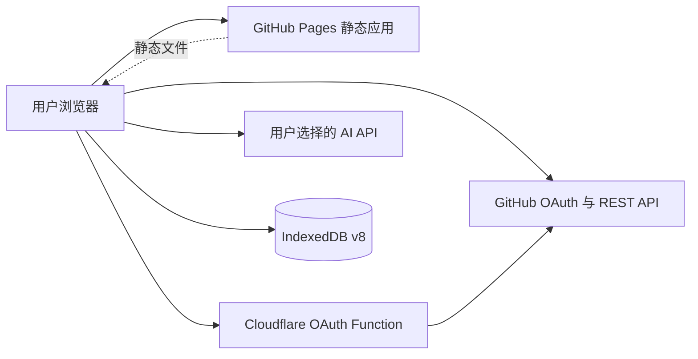
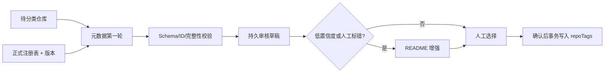

# 架构与数据流

## 系统边界



StarHub 没有中心业务数据库。Cloudflare 只参与 OAuth code 交换；浏览器直接访问 GitHub 与 AI 供应商。

## Stars 同步

```text
GitHub 分页 API
→ 规范化仓库记录
→ 串行数据变更队列
→ repos
→ 保留 repoTags 与 repositoryHighlights
→ 更新 Pinia 与筛选视图
```

同步不能用简单“清空后重建”代替，否则会破坏本地关系。取消 Star 也必须以 GitHub 请求成功为前提，再更新本地状态。

## 分类关系

```text
tags（元数据） ← tagId → repoTags ← repoId → repos
```

`repoTags` 是唯一关系真相。安全重命名只改变 `tags` 显示字段；合并分类在单事务内迁移关系、去重并删除源分类。治理前快照保存分类与关系，用于撤销。

## AI 分类任务



关键不变量：

- 模型只能返回任务给出的仓库短 ID 与正式 category ID；
- 未知、重复、遗漏、越界或截断结果不能自动修补写库；
- 注册表版本随任务记录，变更后旧结果不得静默映射；
- 任务支持暂停、恢复、失败项重试和取消；
- 暂停时可提交当前有效草稿，但提交后结束任务，剩余仓库创建新任务；
- README 第二轮只处理需要增强的候选，并使用缓存和长度上限。

## 认证与密钥

| 凭据 | 所在位置 | 生命周期 |
|---|---|---|
| GitHub Client Secret | Cloudflare encrypted secret | 服务端配置 |
| GitHub access token | 浏览器 `sessionStorage` | 最长 12 小时会话 |
| AI API Key | 浏览器 `sessionStorage` | 标签页/浏览会话结束或用户清除；当前无单独计时 TTL |
| AI 非敏感偏好 | `localStorage` | 持久到用户清除 |

任何备份都不应包含这些凭据。

## 部署

`main` 触发 Pages 工作流：应用构建到 `/StarHub/`，文档构建到 `/StarHub/docs/`，再以 `deployment-info.json` 和公网资源请求验证提交。Cloudflare 项目独立构建 `cloudflare-dist` 与根目录 Functions。

## 当前风险边界

- 浏览器是单机数据源，清理站点数据不可由服务端恢复；
- AI 供应商的 JSON 能力、价格和模型可用性会变化；
- GitHub 和 AI 限流需要持久任务、暂停和重试；
- 17k 级数据需要分页、虚拟列表、增量计算和避免一次性 README；
- 完整备份目前不含 AI 任务、README 缓存与迁移快照；
- 清空/导入路径尚未清理全部 AI 历史表，必须在下一批修复。
